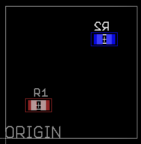
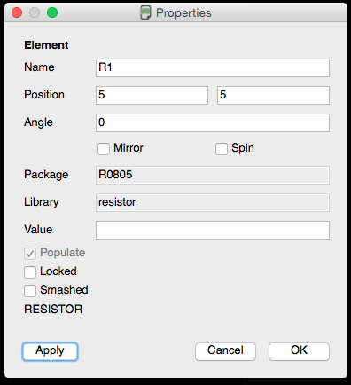
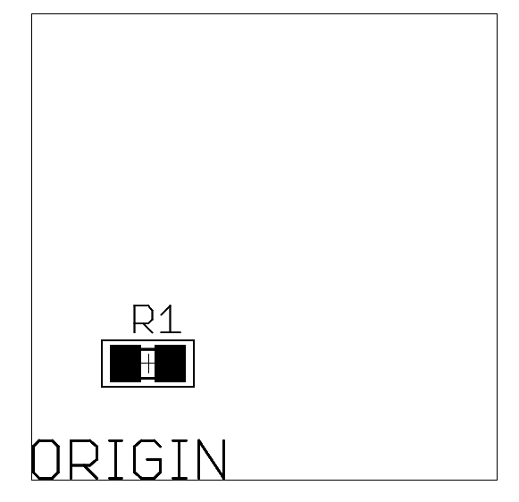
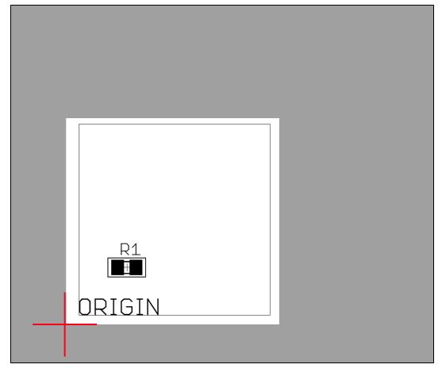
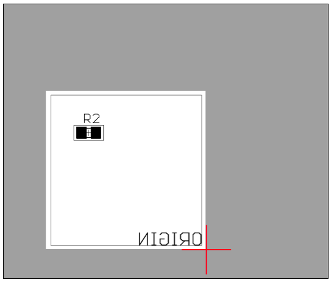

# Deprecation Warning

Please note that due to a recent change this document is outdated. The method described here still works, but there is now a better way to set board locations. You can now use the same board location for both the top and bottom of the board, as long as you also specify the width of the board.

# New Method

Simply use the same board location for the top and bottom of the board, and make sure you set the board width. This diagram illustrates it:

# Outdated Method

In OpenPnP all placements are made relative to the origin of the board, which is the X, Y coordinate of 0,0. We call this the Board Location.

Typically a board's origin will be the bottom left corner when looking at the top, but it doesn't have to be. All that matters is that your placements all use the same reference point for 0,0.

If you place a part at 10,10 on the top of your board and your origin is the bottom left corner of the board then that part will be 10 units to the right and 10 units up from the bottom left corner.

If you place a part at the same position but on the bottom of the board, the coordinate remains the same but the part is considered to be "mirrored"; that is, when looking *through* the board from the top the part will appear to be flipped. If you were to flip the board over the part appears correct but the origin is now in the bottom right, instead of the bottom left.

Consider this simple board:

It has two resistors: R1 and R2. R1 is at 5,5 and R2 is at 15,15.

When we look at the top of the board we see R1, but not R2, because R2 is on the bottom.

And when we look at the bottom we see R2, but not R1. But now, since we have turned the board over, the origin is in the bottom right instead of the bottom left.

It appears that R2 has moved 15 units left, but really all we've done is turned the board over, changing the origin.

If you were to think about how you would move from the origin to R2 you would start on the bottom right corner and move 15 units left and 15 units up.

OpenPnP handles this the exact same way. When OpenPnP needs to move to a placement on the bottom of the board it negates the X coordinate so that instead of moving to the right it moves to the left.

Now consider this board on the bed of your pick and place machine. First you set it up to place the top:

The red crosshair represents where you tell OpenPnP the board origin is. This is the board location.

When you are ready to place the bottom you flip the board over:

And since the board origin has moved, you tell OpenPnP where to find it.

Now when OpenPnP needs to move to a coordinate on the bottom of the board it starts at the origin and counts however many units left, instead of right, to get to the position.